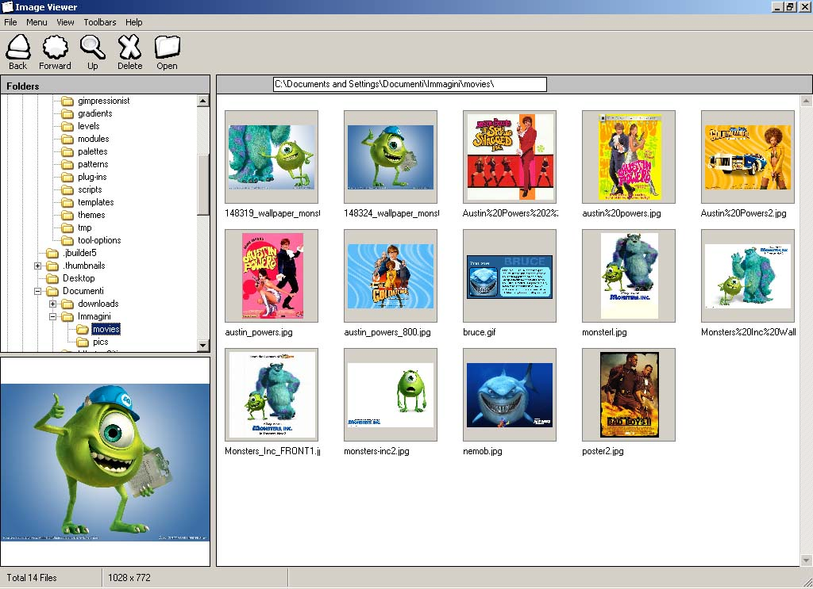



## Fabipo\-Image Viewer

### Description

It is an Image Viewer (similar to ACDSee) which displays the contents of a folder as thumbnails. Its able to read jpg, gif and bmp image formats.
 
### More Info
 
occasionally returns an error when the user resizes the form.

             |
---                |---
**Submitted On**   |2004-09-13 13:42:42
**By**             |[Fabiop](https://github.com/Planet-Source-Code/PSCIndex/blob/master/ByAuthor/fabiop.md)
**Level**          |Intermediate
**User Rating**    |4.3 (34 globes from 8 users)
**Compatibility**  |VB 6\.0
**Category**       |[Graphics](https://github.com/Planet-Source-Code/PSCIndex/blob/master/ByCategory/graphics__1-46.md)
**World**          |[Visual Basic](https://github.com/Planet-Source-Code/PSCIndex/blob/master/ByWorld/visual-basic.md)
**Archive File**   |[Fabipo\-Ima1794029152004\.zip](https://github.com/Planet-Source-Code/fabiop-fabipo-image-viewer__1-56196/archive/master.zip)

